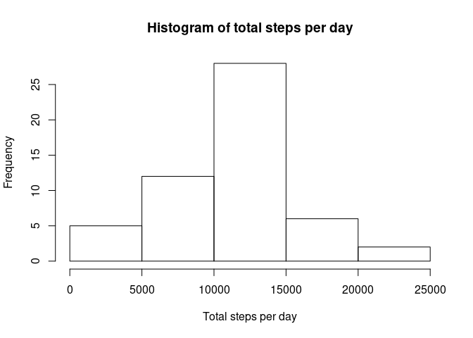
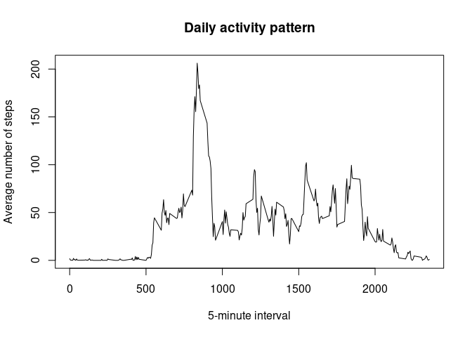
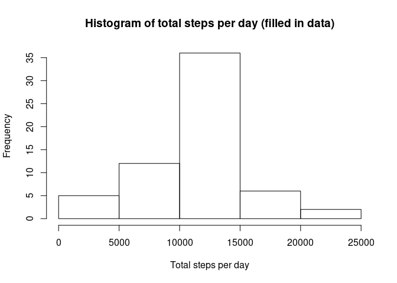
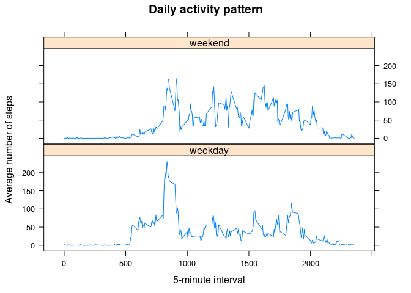

## Loading and preprocessing the data

Load the data and convert date column into Date type.


```r
activity <- read.csv(unz("activity.zip", "activity.csv"))
activity$date <- as.Date(activity$date)
```

## What is mean total number of steps taken per day?

Compute the total number of steps per day.


```r
total_steps_per_day <- tapply(
    activity$steps,
    activity$date,
    sum
)
```

Make a histogram of the total number of steps taken each day


```r
hist(
    total_steps_per_day,
    xlab = "Total steps per day",
    main = "Histogram of total steps per day"
)
```

<!-- -->

Calculate and report the mean and median total number of steps taken per day.


```r
mean_total_steps_per_day <- mean(total_steps_per_day, na.rm = TRUE)
mean_total_steps_per_day
```

```
## [1] 10766.19
```

Mean of total number of steps taken per day equals
**10766**.


```r
median_total_steps_per_day <- median(total_steps_per_day, na.rm = TRUE)
median_total_steps_per_day
```

```
## [1] 10765
```

Median of total number of steps taken per day equals
**10765**.

## What is the average daily activity pattern?

Calculate the number of steps taken, averaged across all days for each of the
5-minute intervals.


```r
average_steps_by_interval <- tapply(
    activity$steps,
    activity$interval,
    mean, na.rm = T
)
```

Make a time series plot of the 5-minute interval (x-axis) and the average
number of steps taken, averaged across all days (y-axis)


```r
plot(
    average_steps_by_interval ~ names(average_steps_by_interval),
    type="l",
    main = "Daily activity pattern",
    xlab = "5-minute interval",
    ylab = "Average number of steps"
)
```

<!-- -->

Which 5-minute interval, on average across all the days in the dataset,
contains the maximum number of steps?


```r
most_active_interval <- which.max(average_steps_by_interval)
names(most_active_interval)
```

```
## [1] "835"
```

The **835** 5-minute interval contains the maximum
number of steps
(206
steps on average).

## Imputing missing values

Calculate and report the total number of missing values in the dataset.


```r
number_of_missing_values <- sum(is.na(activity$steps))
number_of_missing_values
```

```
## [1] 2304
```

There are **2304** missing calues in the dataset.

Fill in all of the missing values in the dataset. Use the mean for given
5-minute interval (averaged across all days).


```r
fill_missing_value <- function(i) {
    steps <- activity$steps[[i]]
    if (is.na(steps)) {
        interval <- as.character(activity$interval[[i]])
        round(average_steps_by_interval[[interval]])
    }
    else {
        steps
    }
}

steps_filled_in <- sapply(seq_along(activity$steps), fill_missing_value)
```

Create a new dataset that is equal to the original dataset but with the missing
data filled in.


```r
activity_filled_in <- data.frame(
    steps = steps_filled_in,
    date = activity$date,
    interval = activity$interval
)
```

Compute the total number of steps per day (filled in data).


```r
total_steps_per_day_filled_in <- tapply(
    activity_filled_in$steps,
    activity_filled_in$date,
    sum
)
```

Make a histogram of the total number of steps taken each day (filled in data).


```r
hist(
    total_steps_per_day_filled_in,
    xlab = "Total steps per day",
    main = "Histogram of total steps per day (filled in data)"
)
```

<!-- -->

Calculate and report the mean and median total number of steps taken per day.


```r
mean_total_steps_per_day_filled_in <- mean(total_steps_per_day_filled_in)
mean_total_steps_per_day_filled_in
```

```
## [1] 10765.64
```

Mean of total number of steps taken per day equals
**10766**.


```r
median_total_steps_per_day_filled_in <- median(total_steps_per_day_filled_in)
median_total_steps_per_day_filled_in
```

```
## [1] 10762
```

Median of total number of steps taken per day equals
**10762**.


The value of mean total number of steps taken per day didn't change
comparing to the original data. It is because the strategy for filling in
missing data was based on the mean across all days.

The value of median total number of steps taken per day changed slightly.
The change in median wasn't big because the distribution of total steps per day
appears to be close to normal distribution so the values for mean and median
are close to each other.

On the new histogram, comparing to the histogram for original data, we can see
increase in frequency of the average number of steps.


## Are there differences in activity patterns between weekdays and weekends?

Create a new factor variable in the dataset with two levels – “weekday” and
“weekend” indicating whether a given date is a weekday or weekend day.


```r
weekdays <- weekdays(activity_filled_in$date)

weekdays_or_weekends <- function(day) {
    if (day %in% c("Saturday", "Sunday")) {
        "weekend"
    }
    else {
        "weekday"
    }
}

activity_filled_in$day_type <- as.factor(sapply(weekdays, weekdays_or_weekends))
```

Calculate the number of steps taken, averaged across all weekdays and weekends
for each of the 5-minute intervals.


```r
average_steps_by_interval_and_day_type <- aggregate(
    steps ~ interval + day_type,
    activity_filled_in,
    mean
)
```

Make a panel plot containing a time series plot of the 5-minute interval
(x-axis) and the average number of steps taken, averaged across all weekday
days or weekend days (y-axis).


```r
library(lattice)
xyplot(
    steps ~ interval | day_type,
    data = average_steps_by_interval_and_day_type,
    type = "l",
    layout = c(1, 2),
    main = "Daily activity pattern",
    xlab = "5-minute interval",
    ylab = "Average number of steps"
)
```

<!-- -->
